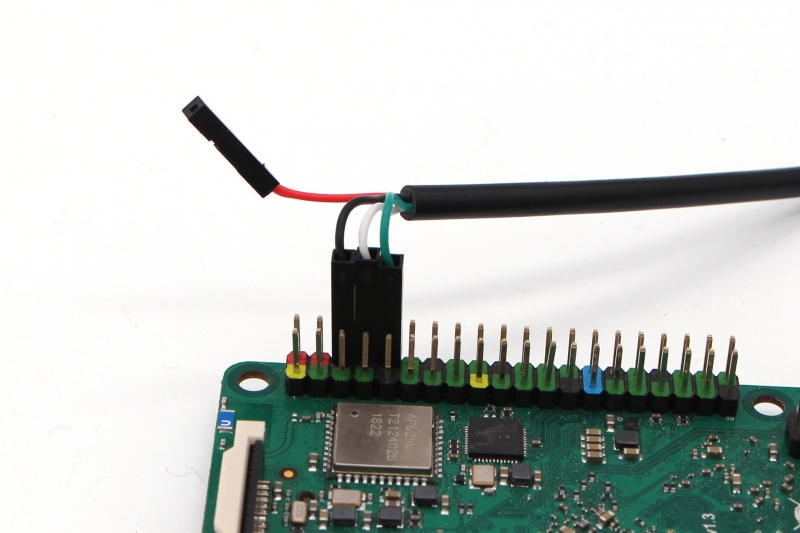

# Rock Pi 4
The current recipe builds a Debian image based on testing

## Build
```
debos debimage-rockpi4.yml
```

## Flash
In order to flash the image on the eMMC the options are:
- eMMC adapter
- USB Flash

### eMMC adapter
With an eMMC adapter the flashing process is trivial

```
dd if=debian-rockpi4.img of=/dev/mmcblk0
```

### USB Flash
In case of using USB Flash, follow the steps [here](https://wiki.radxa.com/Rockpi4/dev/usb-install) to 
- Install rkdeveloptool
- Boot the board into mask mode

```
rkdeveloptool wl 0 debian-rockpi4.img
```

## Console
The conection for the console is shown in the picture


```
baudrate: 1500000
data bit: 8
stop bit: 1
parity  : none
flow control: none
```
